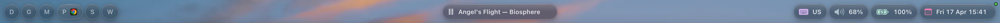

# NanoBar

A lightweight, plugin-based status bar for macOS — pure Swift/SwiftUI, no Electron, no shell scripts on the hot path.

**Requires macOS 15 (Sequoia) or later**



---

## What it looks like

| Default layout                          | Glassmorphic pills                  | AeroSpace workspaces                          |
| --------------------------------------- | ----------------------------------- | --------------------------------------------- |
|  |  |  |

---

## Features

- **Liquid Glass pills** — native macOS 26 glass effect with per-widget hover/focus states; vibrancy blur fallback on macOS 15
- **Plugin system** — extend with `.bundle` plugins; drop in or point to a path
- **Multi-monitor** — one bar per screen, automatically managed
- **Fullscreen aware** — bar hides when a fullscreen window covers the screen
- **AeroSpace integration** — workspace indicator with socket-based live updates
- **Native performance** — ~2% CPU at idle

---

## Installation

### Homebrew (recommended)

```bash
brew install xeydev/tap/nanobar
brew services start nanobar
```

### From source

```bash
git clone https://github.com/xeydev/nanobar
cd nanobar
bash build-release.sh
```

Produces a `dist/` directory with `bin/nanobar`, `libexec/NanoBar`, `libexec/NowPlayingHelper`, and all plugin bundles under `libexec/Plugins/`. Add `dist/bin` to your `PATH` or copy the contents to your preferred prefix.

Logs: `/tmp/nanobar.log` and `/tmp/nanobar.err`.

---

## Configuration

Config lives at `~/.config/nanobar/config.toml` and is created automatically on first launch.

```toml
[widgets]
left   = ["workspaces"]
center = ["now_playing"]
right  = ["keyboard", "volume", "battery", "clock"]
```

That's all you need to get started. Everything else is optional.

### Bar appearance

```toml
[bar]
background   = "none"    # none | blur | color:#RRGGBBAA
minHeight    = 30
cornerRadius = 0
shadow       = false
margin       = 0         # gap between screen edge and bar
padding      = 8         # gap between bar edge and pill widgets
border       = false
```

`margin` and `padding` accept a scalar (all sides) or a per-side table:

```toml
margin  = { all = 6, top = 4 }
padding = { all = 8, left = 16 }
```

### Pill appearance

```toml
[pill]
style        = "liquidGlass"   # liquidGlass | solid | none
height       = 30
cornerRadius = 15
border       = true            # false | true | { width = 0.75, color = "#FFFFFF47" }

[pill.liquidGlass]
# Glass effect per interaction state. effect: "regular" | "clear" | "identity"
# tint: "#RRGGBBAA" hex, or omit for no tint.
defaultEffect = "clear"
# defaultTint = "#FFFFFF20"
hoverEffect   = "regular"
hoverTint     = "#FFFFFF30"
toggledEffect = "regular"
toggledTint   = "#FFFFFF30"

[pill.liquidGlass.blur]
# Pre-macOS 26 fallback — ignored on macOS 26+ (glass handles itself).
material = "regular"   # regular | thin | ultraThin
specular = true
shadow   = true
```

Override per-plugin:

```toml
[plugins.clock.pill]
cornerRadius = 20
border       = { width = 1.0, color = "#FF7EB6" }
```

---

## Built-in Plugins

All bundled plugins are auto-discovered at startup — no `bundle` key required.

| Plugin                    | Widget ID     | Settings                                                  |
| ------------------------- | ------------- | --------------------------------------------------------- |
| **Clock**                 | `clock`       | `format` (date format string), `color`                    |
| **Battery**               | `battery`     | `color`, `warnColor`, `medColor`, `lowColor`              |
| **Volume**                | `volume`      | `color`                                                   |
| **Keyboard layout**       | `keyboard`    | `color`                                                   |
| **AeroSpace workspaces**  | `workspaces`  | `mode`: `labelsOnly` \| `activeIcons` \| `clampAndExpand` |
| **Spotify / Now Playing** | `now_playing` | `activeColor`                                             |
| **Tmux session**          | `tmux`        | `color`                                                   |

Example plugin config:

```toml
[plugins.clock]
format = "EEE dd MMM HH:mm"
color  = "#FF7EB6"

[plugins.battery]
color     = "#B5EAD7"
warnColor = "#FFD1A8"
medColor  = "#FEFAC1"
lowColor  = "#FFB3BF"

[plugins.volume]
color = "#AEC6CF"

[plugins.keyboard]
color = "#DDB6F2"

[plugins.workspaces]
mode = "clampAndExpand"

[plugins.now_playing]
activeColor = "#B5EAD7"
```

---

## AeroSpace Integration

The workspaces plugin listens on a Unix socket. Add this to `~/.aerospace.toml`:

```toml
exec-on-workspace-change = ['/bin/bash', '-c',
  'printf "%s" "$AEROSPACE_FOCUSED_WORKSPACE" | nc -U /tmp/nanobar-notify.sock']
```

Add this manually to `~/.aerospace.toml`.

---

## Writing a Plugin

Plugins are macOS `.bundle` targets linked against `NanoBarPluginAPI`.

### 1. Entry point

Set `NSPrincipalClass` in `Info.plist` to your entry class name, then implement `NanoBarPluginEntry` and optionally `NanoBarPluginSettingsProvider`:

```swift
import NanoBarPluginAPI

@objc(MyPlugin)
public final class MyPlugin: NSObject, NanoBarPluginEntry, NanoBarPluginSettingsProvider {
    public var pluginID: String { "my_widget" }  // matches [plugins.my_widget] key

    // Call resolvedSettings() to merge schema defaults into the raw dict,
    // so the factory can safely force-unwrap every key.
    @MainActor
    public func registerWidgets(with registry: any NanoBarWidgetRegistry, config: [String: String]) {
        registry.register(MyWidgetFactory(config: resolvedSettings(config)))
    }

    public var displayName: String { "My Widget" }

    // All default values live here — nowhere else.
    public func settingsSchema() -> [SettingsField] {[
        SettingsField(key: "color", label: "Color", type: .color,
                      defaultValue: Theme.myColor.toHex8() ?? ""),
    ]}
}
```

### 2. Widget factory

```swift
import NanoBarPluginAPI
import SwiftUI

private final class MyWidgetFactory: NSObject, NanoBarWidgetFactory {
    private let config: [String: String]
    init(config: [String: String]) { self.config = config }

    var widgetID: String { "my_widget" }

    @MainActor func makeViewBox() -> NanoBarViewBox {
        // resolvedSettings() guarantees every schema key is present.
        // Use ! for key access; keep ?? only as a parse-error guard for colors.
        let color = Theme.color(hex: config["color"]!) ?? Theme.myColor
        return NanoBarViewBox(AnyView(MyWidgetView(color: color)))
    }
}
```

### 3. Build

Declare a `.bundle` target in `Package.swift` (see existing plugins for the canonical setup). Use `./build-dev.sh` to compile, or `./run` to rebuild and relaunch NanoBar:

```bash
./build-dev.sh   # debug build; links plugin bundles into .build/debug/Plugins/
```

Point to a third-party plugin from config:

```toml
[plugins.my_widget]
bundle = "/path/to/MyPlugin.bundle"
color  = "#AABBCC"   # only non-default values needed
```

Every key in `[plugins.<id>]` other than `bundle` and `pill` is forwarded to the plugin as `[String: String]` in `registerWidgets`. Keys absent from the TOML file are filled from `settingsSchema()` defaults by `resolvedSettings()`.

---

## Uninstalling

```bash
launchctl unload ~/Library/LaunchAgents/com.user.nanobar.plist
rm ~/Library/LaunchAgents/com.user.nanobar.plist
sudo rm /usr/local/bin/nanobar
rm -rf ~/.config/nanobar   # optional — removes your config
```
